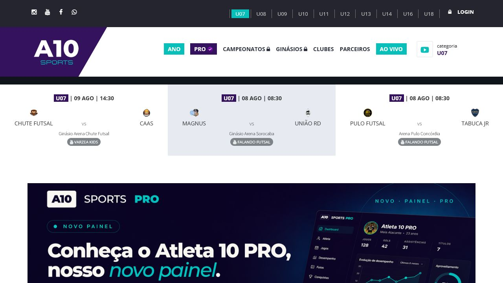
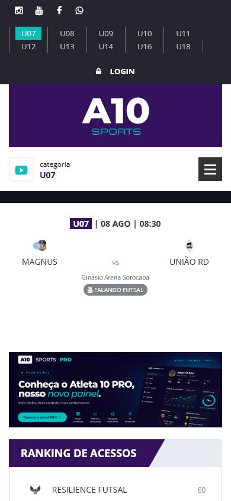
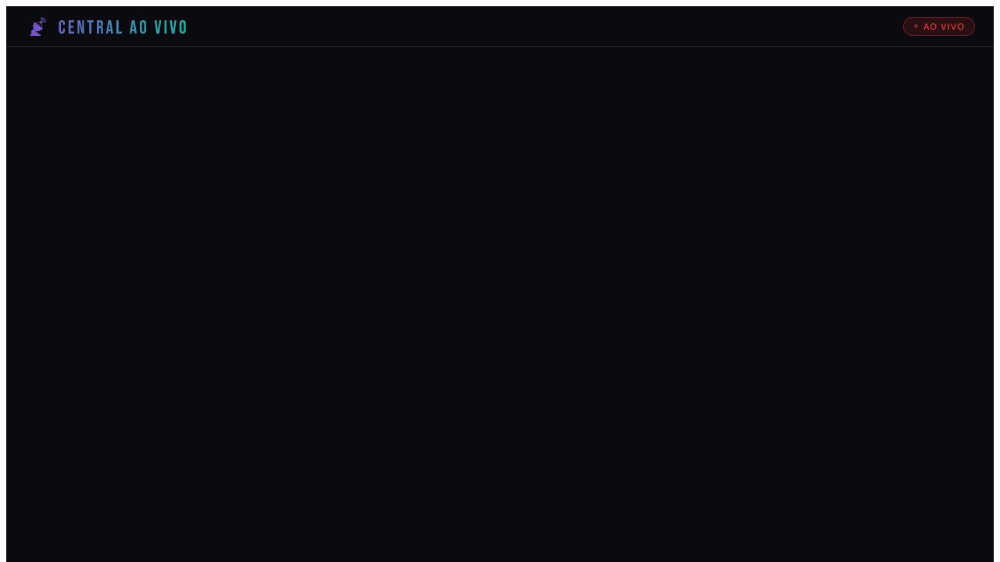
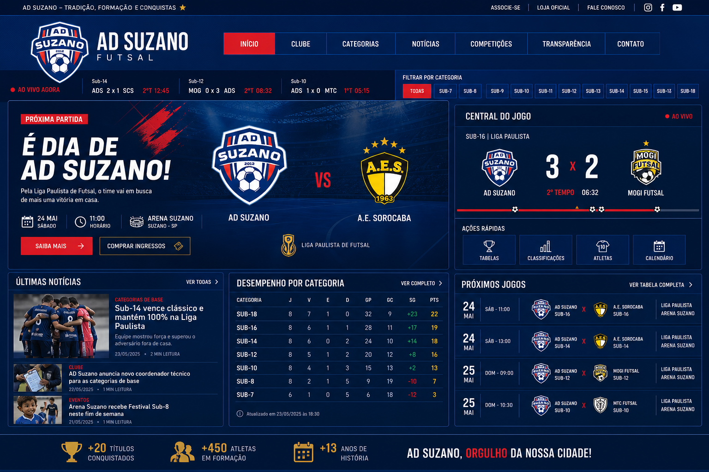
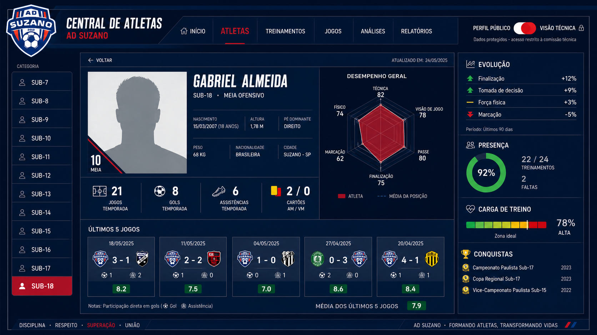
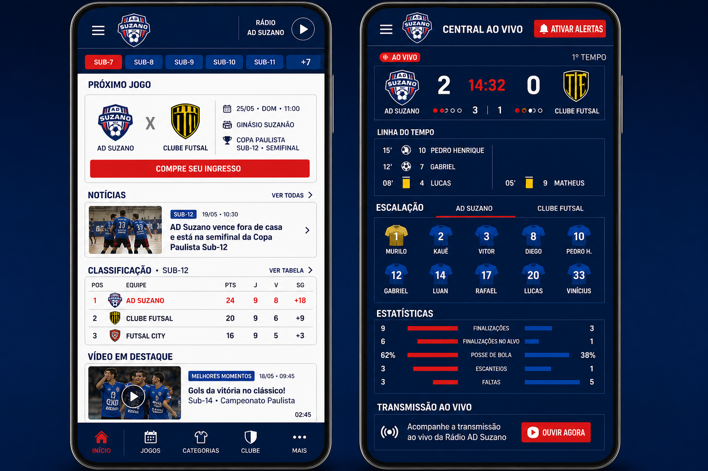

# Dossiê estratégico — A10 Sports → AD Suzano

Data da auditoria: 4 de agosto de 2026
Escopo: páginas públicas, navegação desktop/mobile, central ao vivo, catálogo de clubes, parceiros de transmissão, cadastro e acesso PRO.

## Resumo executivo

A A10 Sports não deve ser copiada como identidade visual. O valor real está no modelo mental: ela apresenta o futsal como uma central de informação contínua — categoria, agenda, partida, transmissão, clube e atleta estão conectados.

A AD Suzano já possui ativos que a A10 não entrega com a mesma profundidade pública: identidade institucional, notícias próprias, categorias do clube, análises técnicas, elenco, resultados de duas competições e administração dos atletas. A evolução ideal é unir esses ativos em uma experiência de **portal oficial + central de jogo + inteligência esportiva**.

Proposta de posicionamento:

> O portal oficial de formação e desempenho da AD Suzano — da arquibancada à comissão técnica.

## Evidências visuais da auditoria

### A10 — página inicial desktop

Pontos observados: seletor persistente por categoria, agenda em destaque, placares com escudos e local, acesso a transmissão, promoção do ambiente PRO e ranking de acessos.

### A10 — página inicial mobile

Pontos observados: categorias continuam acessíveis, menu vira hambúrguer, a partida assume o primeiro plano e o conteúdo passa a ser vertical.

### A10 — central ao vivo

Ponto observado: existe uma tela dedicada à transmissão, com linguagem visual própria de broadcast. Na auditoria, a área estava essencialmente vazia, então o conceito é mais forte que a execução pública encontrada.

## O que a A10 faz bem

1. **Categoria como contexto global** — U07 a U18 aparecem no topo e filtram o ecossistema.
2. **Jogo como unidade central** — data, hora, clubes, ginásio e transmissão aparecem juntos.
3. **Sensação de atualização contínua** — o usuário percebe que há algo acontecendo agora ou em breve.
4. **Escudos e placares escaneáveis** — o conteúdo esportivo é entendido antes mesmo da leitura completa.
5. **Separação entre portal público e ambiente PRO** — conteúdo aberto para descoberta; gestão e dados pessoais protegidos.
6. **Rede do futsal** — clubes, ginásios e parceiros de transmissão formam um diretório útil.
7. **Mobile com prioridade correta** — categoria, próximo jogo e menu vêm antes do conteúdo secundário.

## O que não devemos copiar

1. **Identidade roxa/turquesa** — não pertence à AD Suzano e enfraqueceria o azul, vermelho e branco do clube.
2. **Excesso de categorias na primeira faixa mobile** — funciona como filtro, mas ocupa muita altura e pode ser condensado em rolagem horizontal com “+ categorias”.
3. **Links bloqueados sem explicação suficiente** — clubes e ginásios podem levar diretamente ao login. Na AD Suzano, toda área protegida deve explicar o benefício e para quem é destinada.
4. **Problemas de caracteres** — foram encontrados textos como “HORTOLâNDIA”, sinal de inconsistência de codificação. Nosso portal deve manter UTF-8 de ponta a ponta.
5. **Links de partida sem destino real** — alguns clubes e partidas usam `#`; isso gera expectativa sem entregar ação.
6. **Ranking de acessos como destaque editorial** — popularidade não é o mesmo que relevância para o clube. Para a AD, o destaque deve ser desempenho, agenda, formação e conquistas.
7. **Central ao vivo vazia** — nunca exibir uma tela “ao vivo” sem estado vazio útil. Deve mostrar próxima transmissão, contagem regressiva ou replay.
8. **Cadastro amplo sem validação institucional visível** — para dados de menores, o fluxo da AD deve exigir autorização e papéis claros.

## O que trazer para a AD Suzano

| Ideia inspiradora | Adaptação AD Suzano | Prioridade |
|---|---|---|
| Seletor U07–U18 | Seletor global Sub-7–Sub-18 que mantém contexto entre Jogos, Atletas, Notícias e Análises | P0 |
| Faixa de partidas | “Radar da Rodada” com próximo jogo, último resultado e transmissão | P0 |
| Central ao vivo | Match Center com placar, cronômetro, eventos, escalação e link oficial de transmissão | P1 |
| Área PRO | “AD Performance”, dividida em Comissão Técnica, Coordenação e Administração | P1 |
| Página de clube | Página pública única da AD com conquistas, categorias, agenda e números | Já existe; reorganizar |
| Perfis de atleta | Perfil público controlado + ficha técnica protegida | Em andamento; aprofundar |
| Parceiros de transmissão | Diretório “Onde assistir” com canais verificados e replay | P1 |
| Ginásios | Arena Suzano e locais de jogos com mapa, endereço, acessibilidade e regras de entrada | P2 |
| Alertas | Notificação de jogo, resultado, notícia e nova súmula | P2 |

## Nova arquitetura proposta

### Camada pública

- **Início** — próximo jogo, último resultado, notícias, classificação e conquistas.
- **Jogos** — calendário, resultados, súmulas, transmissão/replay e filtros por competição/categoria.
- **Categorias** — uma página por Sub com elenco, comissão, campanha, notícias e próximos compromissos.
- **Atletas** — cards premium, ficha pública aprovada e conquistas.
- **Competições** — Paulista A2 e Copa da Juventude com campanhas separadas e consolidadas.
- **Notícias & AD TV** — redação esportiva, vídeos, fotos e boletins.
- **Clube** — história, diretoria, estrutura, patrocinadores, transparência e contato.

### Camada protegida: AD Performance

- **Comissão Técnica** — atletas, acréscimos estatísticos, fotos e observações.
- **Análise** — campanhas, sequência, adversários, projeções auditáveis e IA explicável.
- **Treinos** — presença, carga, foco da semana e avaliações técnicas.
- **Documentos** — súmulas, relatórios e histórico de importações.
- **Administração** — permissões, fontes de dados, logs e publicação.

## Conceito 1 — Portal e Central do Jogo

O que aprovar neste conceito:

- navegação retangular e compacta;
- placares e categorias como faixa operacional;
- hero editorial realmente esportivo;
- Match Center ao lado do destaque;
- notícias, desempenho e agenda visíveis sem rolagem longa;
- uso de dourado apenas para conquistas.

Observação: adversários, placares e números da imagem são ilustrativos; a implementação usará apenas dados oficiais.

## Conceito 2 — Central de Atletas

O que aprovar neste conceito:

- alternância clara entre Perfil Público e Visão Técnica;
- últimos cinco jogos contextualizados;
- indicadores de evolução e presença;
- conquistas e histórico esportivo;
- radar técnico com comparação à média da categoria;
- manutenção dos dados sensíveis na área protegida.

Observação: nomes, fotos e números são ilustrativos. Para menores, dados públicos dependerão de autorização e política de privacidade.

## Conceito 3 — Experiência mobile de dia de jogo

O que aprovar neste conceito:

- rádio acessível no topo sem dominar a tela;
- categorias em rolagem horizontal;
- próximo jogo como primeira informação;
- navegação inferior para uso com uma mão;
- Match Center com placar, linha do tempo, escalação e estatísticas;
- alertas e transmissão como ações explícitas.

## Motion.dev — movimentos que agregam significado

1. **Troca de categoria** — conteúdo antigo sai 8 px para a esquerda e o novo entra pela direita; 180–240 ms.
2. **Faixa de jogos** — arraste horizontal com snap e indicador de partida ativa.
3. **Placar ao vivo** — gol gera pulso curto no número e atualização da linha do tempo, sem confete excessivo.
4. **Cards de atleta** — leve inclinação por ponteiro apenas no desktop; no mobile, feedback de pressão.
5. **Gráficos** — linhas e barras reveladas quando entram na tela, respeitando `prefers-reduced-motion`.
6. **Menu mobile** — painel lateral com foco preso, fundo escurecido e fechamento por gesto/escape.
7. **Estado de atualização** — skeletons discretos e selo “Atualizado às HH:mm”; nunca esconder atraso de dados.

## Dados e automações necessárias

- consolidar FPFS e Copa da Juventude por categoria, competição e temporada;
- tabela única de partidas com fonte, horário de coleta e status de validação;
- eventos de jogo separados do placar final;
- relacionar atletas às súmulas sem sobrescrever acréscimos manuais;
- fila de revisão quando robô e lançamento manual divergirem;
- estados: oficial, aguardando validação, corrigido e indisponível;
- robôs semanais para atletas e estatísticas; rotina mais frequente para agenda e resultados;
- nunca publicar projeção como fato: probabilidade sempre acompanhada de fórmula, data e limitações.

## Correções imediatas identificadas no portal atual

1. O player da Rádio AD Suzano retornou “Vídeo indisponível” durante a auditoria e registrou erro do player incorporado.
2. A primeira página tem bom conteúdo, mas a hierarquia ainda é institucional; falta o “agora” esportivo: último placar, próximo jogo e classificação acima da dobra.
3. Vídeos e fotos aparecem como conteúdo antigo (“há 3 meses”), o que reduz sensação de portal vivo.
4. A busca e o menu “Mais” existem, mas o seletor de categoria ainda não funciona como contexto global.
5. O Match Center, alertas e replays ainda não constituem uma jornada única.

## Plano de execução

### Fase 1 — Portal vivo (P0)

- nova navegação e seletor global de categoria;
- Radar da Rodada no topo;
- último resultado, próximo jogo, classificação e notícias;
- estado confiável de atualização e fonte;
- correção definitiva do player da rádio.

### Fase 2 — Match Center (P1)

- página de partida;
- transmissão/replay;
- eventos, escalação e estatísticas disponíveis;
- alertas de jogo e resultado;
- páginas completas por categoria.

### Fase 3 — AD Performance (P1)

- evolução do painel da Comissão Técnica;
- presença e avaliações;
- comparação longitudinal;
- logs de alteração e revisão de divergências;
- relatórios exportáveis.

### Fase 4 — Comunidade e receita (P2)

- patrocinadores com métricas e ativações;
- associação/apoio ao clube;
- ingressos quando aplicável;
- campanhas, enquetes e experiências para torcida;
- mídia kit e inventário comercial.

## Decisão recomendada

Aprovar o **Conceito 1 como nova base visual**, incorporar o **Conceito 3 como regra mobile** e desenvolver o **Conceito 2 dentro da área protegida**, liberando apenas uma versão pública controlada dos atletas.

Essa direção não transforma a AD Suzano em uma cópia da A10. Ela transforma o portal em um produto mais completo: oficial, vivo, confiável e proprietário.

## Fontes auditadas

- https://www.a10sports.com.br/
- https://www.a10sports.com.br/clubes
- https://www.a10sports.com.br/aovivo
- https://www.a10sports.com.br/home/tela
- https://www.a10sports.com.br/parceiros
- https://www.a10sports.com.br/pro/login.php
- https://www.a10sports.com.br/pro/cadastro.php
- https://adsuzano.com.br/
